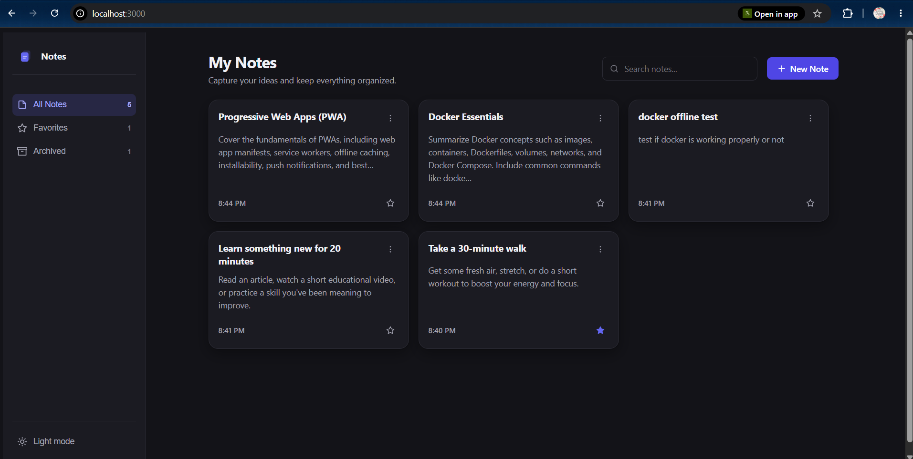
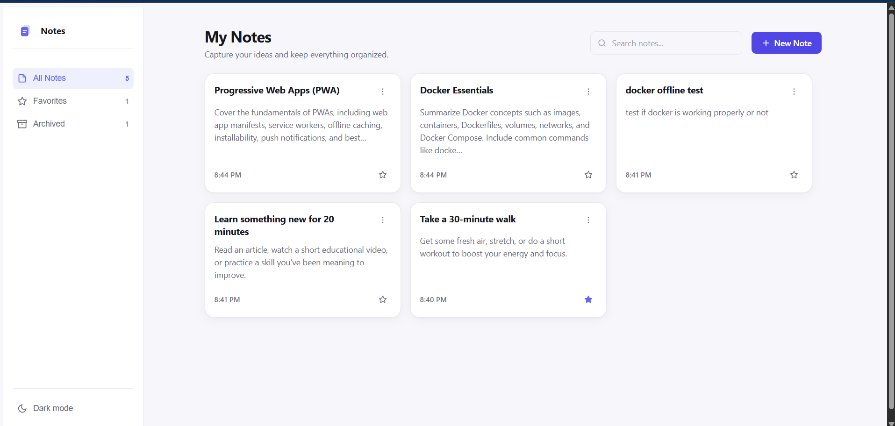
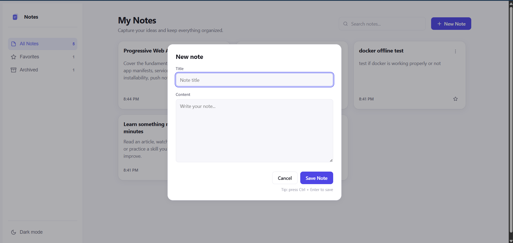
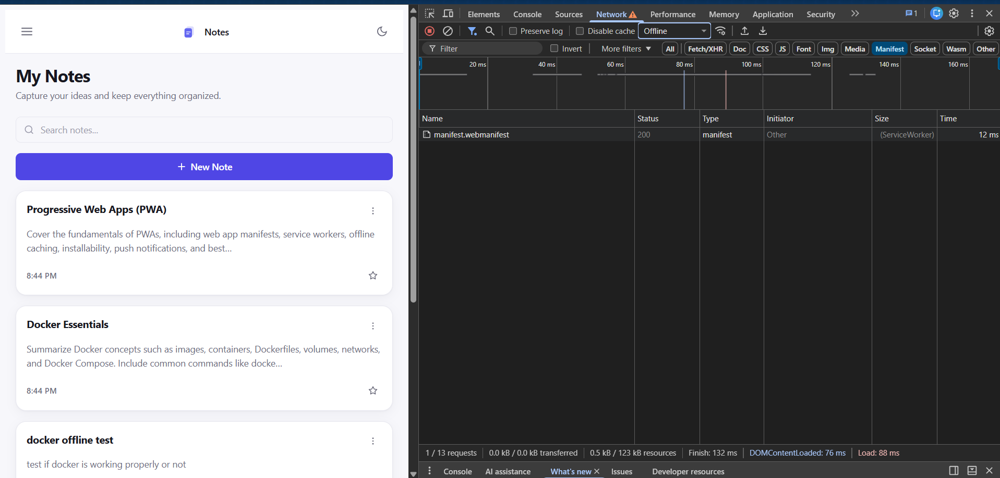
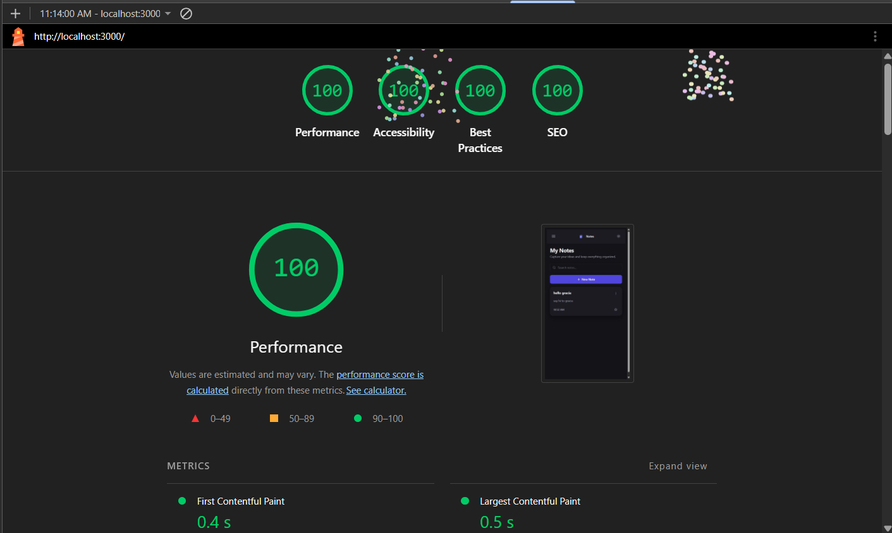

# 📝 Notes PWA – Offline Note Taking Application


A modern, responsive, and offline-first **Progressive Web Application (PWA)** built with **SvelteKit**. This application enables users to create, organize, search, favorite, and archive notes while working seamlessly both online and offline. Notes are stored locally using Local Storage, and the application is fully containerized using Docker for easy deployment.

---

# ✨ Features

- 📝 Create new notes
- ✏️ Edit existing notes
- 🗑️ Delete notes
- ⭐ Mark notes as Favorites
- 📂 Archive notes
- 🔍 Instant search
- 💾 Local Storage persistence
- 📱 Responsive design
- 🌙 Light & Dark mode
- ⚡ Progressive Web App (PWA)
- 📶 Offline support using Service Worker
- 📥 Installable on Desktop & Mobile
- 🐳 Dockerized deployment
- ♿ Accessibility improvements
- 🚀 Optimized Lighthouse performance

---

# 🛠️ Tech Stack

| Technology | Purpose |
|------------|---------|
| SvelteKit | Frontend Framework |
| JavaScript | Programming Language |
| CSS | Styling |
| Vite | Build Tool |
| Vite Plugin PWA | Progressive Web App Support |
| Local Storage | Client-side Data Storage |
| Docker | Containerization |

---

# 📸 Screenshots

## 🏠 Application Preview

<p align="center">
  
  
</p>

---

## ➕ Create New Note

<p align="center">
  
</p>

---

## 📶 Offline Support

<p align="center">
  
</p>

---

## 🚀 Lighthouse Report

<p align="center">
  
</p>

---

# 📂 Project Structure

```text
notes-pwa/
│
├── src/
│   ├── lib/
│   │   ├── components/
│   │   └── assets/
│   │
│   ├── routes/
│   │   ├── +layout.svelte
│   │   └── +page.svelte
│   │
│   └── app.html
│
├── static/
│   ├── icon-192.png
│   ├── icon-512.png
│   └── manifest.webmanifest
│
├── screenshots/
│   ├── home.png
│   ├── light-mode.png
│   ├── new-note.png
│   ├── offline.png
│   └── lighthouse.png
│
├── Dockerfile
├── package.json
├── README.md
└── .gitignore
```

---

# 🚀 Getting Started

## Clone the Repository

```bash
git clone https://github.com/YOUR_GITHUB_USERNAME/notes-pwa.git
```

```bash
cd notes-pwa
```

---

## Install Dependencies

```bash
npm install
```

---

## Start Development Server

```bash
npm run dev
```

Visit:

```
http://localhost:5173
```

---

# 📦 Production Build

Build the application:

```bash
npm run build
```

Preview the production build:

```bash
npm run preview
```

---

# 🐳 Docker

## Build Docker Image

```bash
docker build -t notes-pwa .
```

---

## Run Docker Container

```bash
docker run -d -p 3000:3000 --name notes-pwa-container notes-pwa
```

Visit:

```
http://localhost:3000
```

---

## Start Existing Container

```bash
docker start notes-pwa-container
```

---

## Stop Container

```bash
docker stop notes-pwa-container
```

---

## View Container Logs

```bash
docker logs notes-pwa-container
```

---

# 📱 Progressive Web App

This application includes complete PWA functionality:

- ✅ Installable on Desktop
- ✅ Installable on Android
- ✅ Offline Support
- ✅ Service Worker
- ✅ Web App Manifest
- ✅ Home Screen Installation
- ✅ Fast Loading
- ✅ Responsive Design

---

# 💾 Data Storage

The application stores all notes locally using the browser's **Local Storage**.

No backend server or database is required.

---

# 📊 Lighthouse Scores

| Category | Score |
|----------|------:|
| 🚀 Performance | 100 |
| ♿ Accessibility | 100 |
| ✅ Best Practices | 100 |
| 🔍 SEO | 100 |

---

# 🎯 Future Improvements

- User Authentication
- Cloud Synchronization
- Categories & Tags
- Rich Text Editor
- Markdown Support
- Drag & Drop Notes
- Reminder Notifications
- Export Notes as PDF
- Voice Notes
- End-to-End Encryption

---

# 👨‍💻 Author

**Gracia Sharon Jopson**

MCA Student | Software Developer

GitHub: https://github.com/YOUR_GITHUB_USERNAME

LinkedIn: YOUR_LINKEDIN_URL

---

# 🙏 Acknowledgements

- SvelteKit
- Vite
- Vite Plugin PWA
- Docker
- Lighthouse

---

# 📄 License

This project is licensed under the **MIT License**.

Feel free to use, modify, and distribute this project for learning and educational purposes.